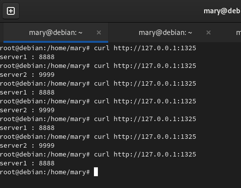
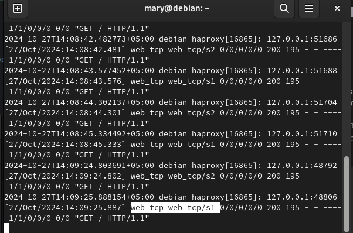
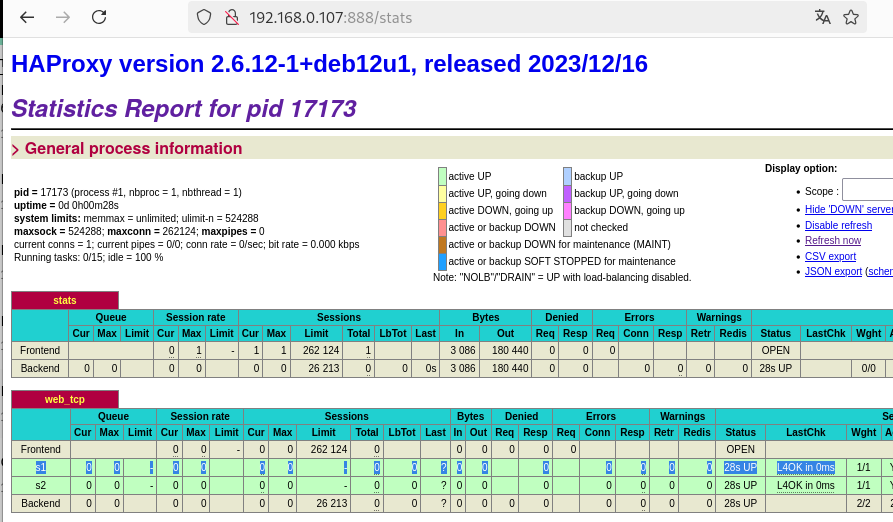
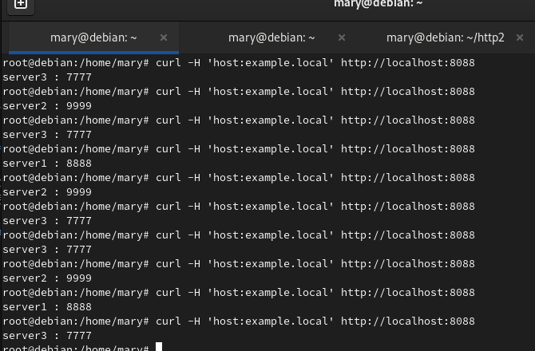
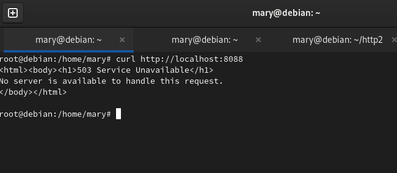
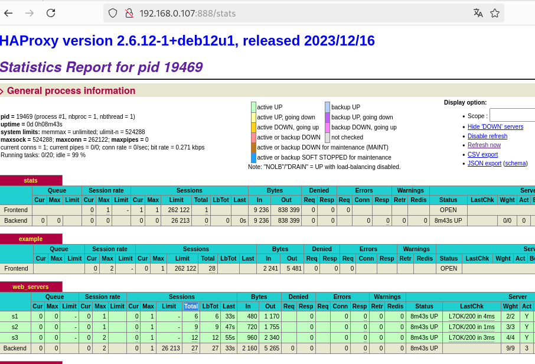

# Домашнее задание к занятию 2 "Кластеризация и балансировка нагрузки" - Варфоломеева Марьяна

### Задание 1

#### Настроить на виртуальной машине балансировку Round-robin на 4 уровне для двух simple python сервераx  на разных портах
    

Для задания использовалась вирт.машина с Debian, ip-адрес - 192.168.0.107.
Был установлен HAProxy.
Для балансировки на 4 уровние (TCP) в файл [/etc/haproxy/haproxy.cfg](./files/haproxy.cfg)
добавлен блок:
```
listen web_tcp

        bind :1325
        balance roundrobin
        server s1 127.0.0.1:8888 check
        server s2 127.0.0.1:9999 check
```

Проверка через обращение к http://127.0.0.1:1325
Видно, что запросы перераспределяются между 2 серверами:


Логи /var/log/haproxy.log:


Также в haproxy.cfg настроен сбор и вывод Статистики. 
В статистике также можно увидеть, что настроена балансировка между серверами s1 и s2 на 4 уровне:



### Задание 2

#### Настроить балансировку Weighted Round Robin на 7 уровне, чтобы первый сервер имел вес 2, второй - 3, а третий - 4.
#### HAproxy должен балансировать только тот http-трафик, который адресован домену example.local.
В конф.файл [haproxy.cfg](./files/haproxy.cfg_2) добавлены секции фронтенд и бэкенд.

Во фронтенде через acl фильтруется трафик: на бэкенд перенаправляются только запросы к домену example.local.
В бэкенде прописаны метод и веса для балансировки.

Проверка через запрос "curl -H 'host:example.local' http://localhost:8088".
Видно, что трафик переаспределяется между тремя серверами s1, s2, s3:


Обращения к http://localhost:8088 не обрабатываются, так как в HAProxy настроена работа только с доменом example.local:


Статистика работы балансировщика. В графе Total видно, как были распределены 27 запросов между 3 серверами согласну их весу:



